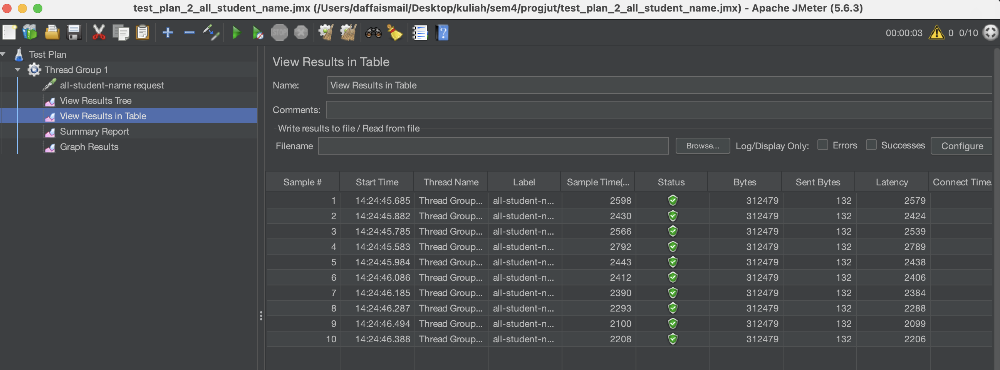
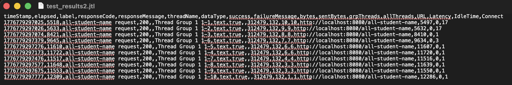
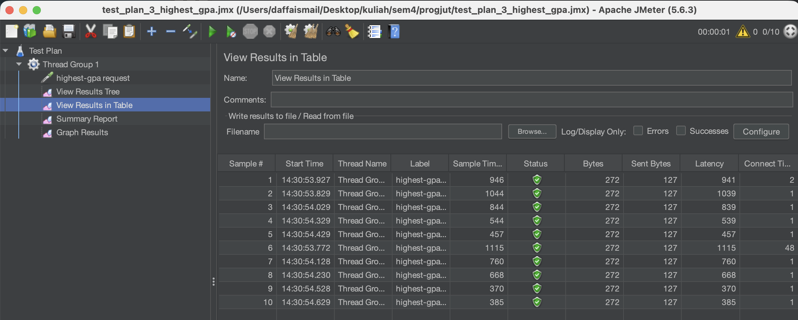
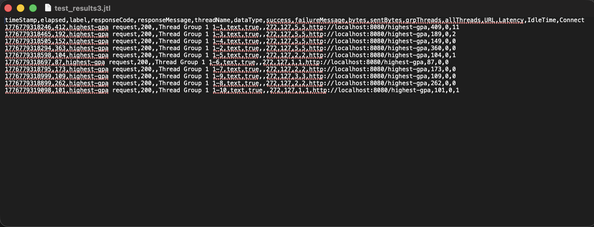

# Modul 7

install deps:
```
./mvnw install
```

running:
```
./mvnw spring-boot:run
```

/all-student-name performance testing result




/highest-gpa performance testing result




Conclusion:

Yes, theres an improvement in jmeter measurements. This shows that inefficient code can really compound and slow down our app as the data and or the amount of users scale up. 

Reflection:

1. What is the difference between the approach of performance testing with JMeter and
profiling with IntelliJ Profiler in the context of optimizing application performance?
2. How does the profiling process help you in identifying and understanding the weak points
in your application?
3. Do you think IntelliJ Profiler is effective in assisting you to analyze and identify
bottlenecks in your application code?
4. What are the main challenges you face when conducting performance testing and
profiling, and how do you overcome these challenges?
5. What are the main benefits you gain from using IntelliJ Profiler for profiling your
application code?
6. How do you handle situations where the results from profiling with IntelliJ Profiler are not
entirely consistent with findings from performance testing using JMeter?
7. What strategies do you implement in optimizing application code after analyzing results
from performance testing and profiling? How do you ensure the changes you make do
not affect the application's functionality?

Answers:

1. JMeter is like a http client that logs performance (blackbox), while intellij profiler analyzes the code we run directly.

2. Profiling shows the metrics of our code, including methods. This helps identify parts of our code that can be optimized.

3. Yes, intellij profiler is very helpful, giving very detailed performance results mapped to our code.

4. One difficulty that was immediately prominent was how the test results for profiling can be inconsistent, said to be caused by jit caching. The solution was to run multiple times and ignore the anomalous metrics, only factor in the metrics that are close together in value.

5. The main benefit for this project is it shows the exact method thats causing the app to slow down, allowing us to quickly iterate the solution. Other benefits include direct analysis of our code and easy access as its integrated into the IDE.

6. JMeter and profiler results I think should be compared relative to itself instead of between each other. Each tool should have a difference in tool overhead and testing method, so it can be unreliable to mix and match results across different tools.

7. For getAllStudentsWithCourses and findStudentWithHighestGpa, I replaced application logic with database/repository logic. The reason being high level languanges is generally slower than sql queries. 

For joinStudentNames, as strings are immutable in java, I opted to build the string with collector instead. This avoids making a new string object and copying over the last string each time it appends a new student name.
